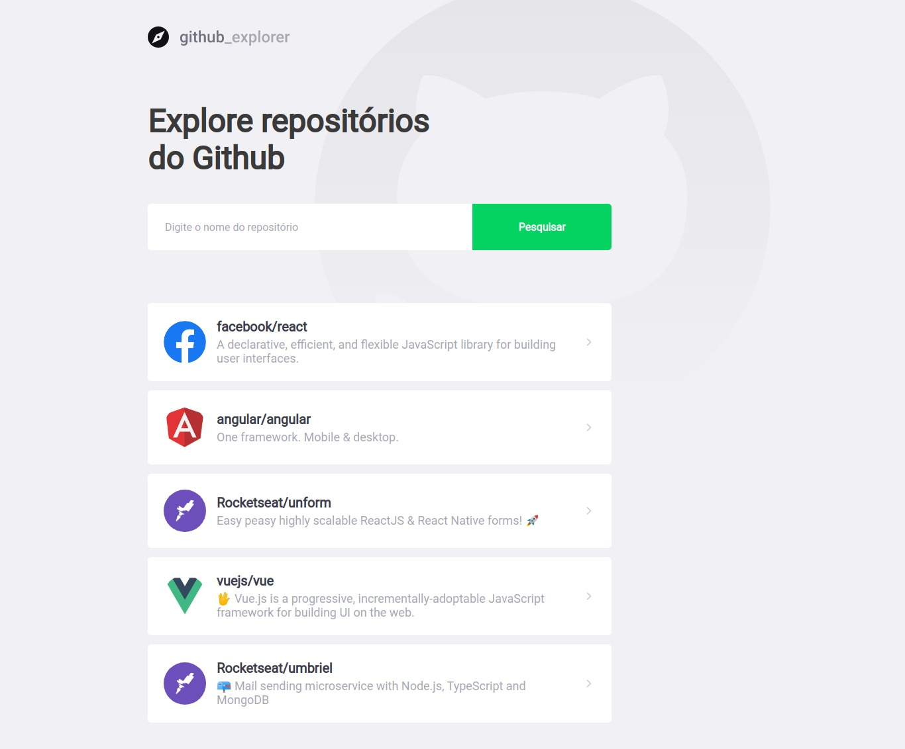
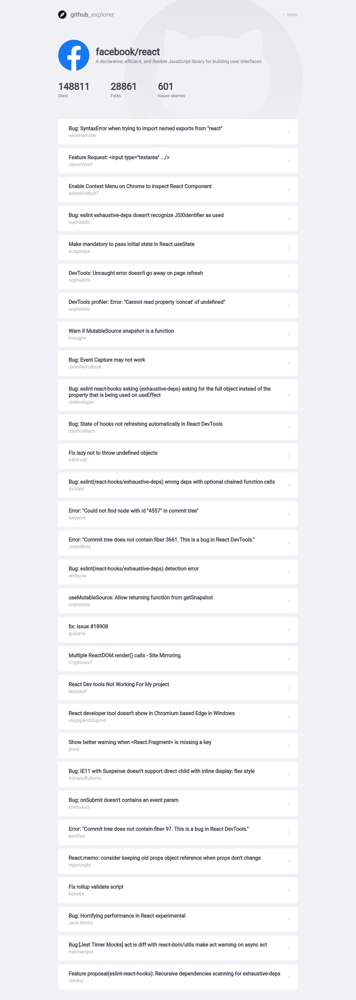

# Github Explorer

Add favorites github repos and see details and issues




## Running localy

```bash
yarn add

yarn start
```

Runs the app in development mode.

Open

[http://localhost:3000](http://localhost:3000/)

to view it in the browser.
